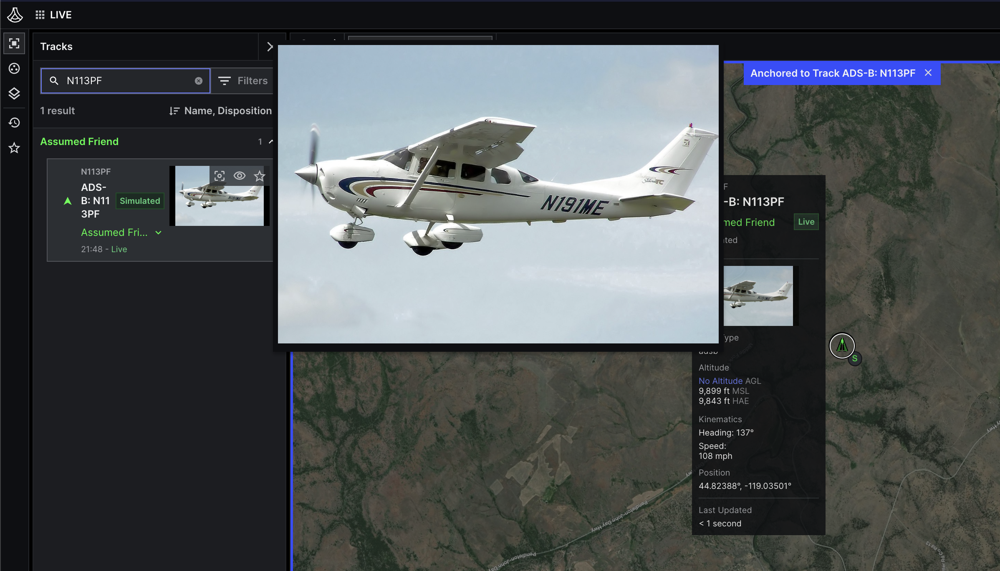

# Lattice SDK: Track thumbnail

This app demonstrates the Lattice SDK Object Store API.

In Lattice, an *object* is a data model that lets you store and access files across your environment.
The Objects API is a content-delivery network service that provides resilient data storage at the edge.
Use objects together with entities to implement use-cases like track thumbnails, and vessle manifests.



For more information about the Objects API, see the following:
- [Objects API](https://developer.anduril.com/reference/rest/objects) in the *Lattice API Reference*.
- [Objects overview](https://developer.anduril.com/guides/objects/overview) in the *Lattice Developer Guide*.

## Before you begin

1. Clone the repository.
1. Install the dependencies:

    ```bash
    $ pip install -r requirements.txt
    ```

1. Get the following authorization tokens from the [Lattice Sandboxes dashboard](/sandboxes.developer.anduril.com):
    - ```authorization``` -- This is your **environment bearer token**, which you can get by choosing your environment
        from the [dashboard list](https://sandboxes.developer.anduril.com/idee/environments).
    - ```anduril-sandbox-authorization``` -- This is your **sandboxes bearer token**, which you can obtain from the
        [Account & Security](https://sandboxes.developer.anduril.com/user-settings) page in Sandboxes.

1. Get your environment URL from the environment details page in Sandboxes.

1. Set your system environment variables:

    ```bash 
    $ export LATTICE_ENDPOINT=lattice-your_env_id.env.sandboxes.developer.anduril.com
    $ export ENVIRONMENT_TOKEN=YOUR_LATTICE_ENVIRONMENT_TOKEN
    $ export SANDBOXES_TOKEN=YOUR_LATTICE_SANDBOXES_TOKEN
    ```

For more information about setting up your environment, see [Set up](https://developer.anduril.com/guides/getting-started/set-up)
in the *Lattice Developer Guide*.

## Usage

Use this example app to upload and download binary data to, and from, Lattice:

```bash
$ python app.py [-h] --operation OPERATION \
    [--file PATH_TO_FILE] \
    [--path PATH_TO_OBJECT_IN_LATTICE] \
    [--entity ENTITY_ID]
```

### Example

1. To upload an object to Lattice and associate it with an entity, use the following:

    ```bash
    $ python app.py --operation upload --file <PATH_TO_FILE> --entity <ENTITY_ID>
    ```

1. To download an existing object from Lattice, use the following:

    ```bash
    $ python app.py --operation download --path <PATH_TO_OBJECT_IN_LATTICE>
    ```
1. To delete an existing object from Lattice, use the following:

    ```bash
    $ python app.py --operation delete --path <PATH_TO_OBJECT_IN_LATTICE> --entity <ENTITY_ID>
    ```

For more information, see the [Lattice SDK documentation](https://developer.anduril.com) website.
